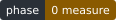
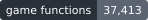
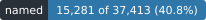
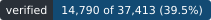
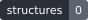
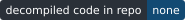
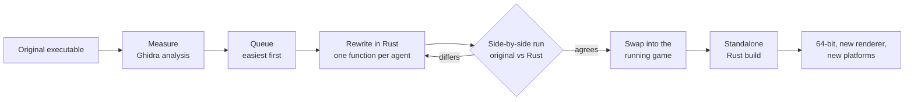

# LibertyFlux

Grand Theft Auto IV's engine, rewritten in Rust one function at a time, so the game can run as a
native 64-bit program on Windows, Windows on ARM and macOS.









**Project site: [monstercameron.github.io/LibertyFlux](https://monstercameron.github.io/LibertyFlux/)**,
with the [changelog](https://monstercameron.github.io/LibertyFlux/changelog.html) and the
[devlog](https://monstercameron.github.io/LibertyFlux/devlog.html).

> **Status: phase 0, measuring.** Nothing has been rewritten yet. The toolchain is installed and the
> method is planned. The badges above are generated from real counts and will stay at zero until
> there is something to count.

## Buy the game

LibertyFlux is not a way to get Grand Theft Auto IV for free, and it never will be. It contains none
of the game: no executable, no data, no assets. To use it you need a copy of the game that you paid
for.

- Buy it on [Steam](https://store.steampowered.com/app/12210/), from an authorised key seller, or
  from a retailer.
- Do not use a pirated or cracked copy. This project does not support them, and issues about them
  will be closed without an answer.
- This project will never distribute game files, keys, cracks or ways around the game's copy
  protection. Contributions that do will be rejected.

The people who made the game should be paid for it.

## Contents

- [Buy the game](#buy-the-game)
- [Why](#why)
- [Goals](#goals)
- [How it works](#how-it-works)
- [What is in the repository, and what never is](#what-is-in-the-repository-and-what-never-is)
- [Roadmap](#roadmap)
- [Tracking progress](#tracking-progress)
- [Repository layout](#repository-layout)
- [Working on it](#working-on-it)
- [Projects this builds on](#projects-this-builds-on)
- [Licence](#licence)
- [Legal](#legal)

## Why

The PC version of GTA IV is a 32-bit Direct3D 9 program from 2008. It submits draw calls on one
thread, ties parts of its physics and scripting to the frame rate, and misbehaves above 60 frames
per second. Community patches fix a great deal, but they cannot change what the program is.

A full rewrite can. Once every function has a Rust replacement, the engine can be built for 64-bit
processors, given a modern renderer, and taken to platforms the original never ran on.

## Goals

| Platform | Graphics | Upscaling |
|---|---|---|
| Windows x64 | Vulkan, with Direct3D 12 optional | DLSS, FSR, XeSS |
| Windows on ARM | Vulkan | FSR |
| macOS on Apple silicon | MoltenVK, then native Metal | MetalFX |

The research behind this table, with links to each vendor's SDK and guides, is in
[documentation/upscaling-and-frame-generation.md](documentation/upscaling-and-frame-generation.md).

None of the following exists yet. These are the reasons for doing the work.

| What the rewrite makes possible | Detail | When |
|---|---|---|
| Hundreds of frames per second | The simulation runs at a fixed rate and the renderer draws as fast as the hardware allows, so physics and scripts behave the same at any speed | Phase 6 |
| Modern upscaling and frame generation | DLSS, FSR, XeSS and MetalFX behind one setting; the renderer is designed to produce the motion and depth data they need | Phase 7 |
| Path tracing | Bounced light, reflections and soft shadows | Stretch goal, after the new renderer |
| Native on three platforms | 64-bit Windows, Windows on ARM and macOS, with no emulation layer | Phases 5 and 6 |
| New gameplay and graphics | Any part of the engine can change: new mechanics, denser streets, longer draw distances, engine-level mods | Phase 7 |
| Nothing extra to install | No .NET, no launcher, no Visual C++ or DirectX runtime packages | Phase 5 |
| Old bugs become tests | The community's list of high-frame-rate bugs is the checklist the new simulation has to pass | Phase 6 |

## How it works

AI agents do the rewriting. A machine check, not an agent's opinion, decides when a function is
finished.



1. **Measure.** Ghidra analyses the original program. Functions are counted, library code is set
   aside, and class names are recovered from the type information the compiler left behind.
2. **Queue.** A script orders the functions from easiest to hardest and hands them out one at a
   time. Agents never choose their own.
3. **Rewrite.** An agent studies the function's behaviour, with the nearest already-finished
   functions as reference, and writes a Rust implementation.
4. **Compare.** The original function and the Rust version run side by side in a small 32-bit test
   process, from the same inputs and starting memory. Their results, memory writes and outgoing calls
   must agree.
5. **Swap in.** Accepted functions are loaded into the original game with an on/off switch each. If
   the game misbehaves, switches are flipped in halves until the faulty one is found.
6. **Cut loose.** When every function has a replacement, the Rust code is built on its own, widened
   to 64-bit, and given a new renderer.

## What is in the repository, and what never is

| Committed | Never committed |
|---|---|
| Structures: fields, sizes, offsets, enums, virtual table order | Decompiler output or disassembly, edited or not |
| Symbols: names, addresses, signatures, hashes, class hierarchy | C or C++ reconstructions of original functions |
| Rust rewrites of the engine's behaviour | Code copied from other reverse-engineering projects |
| Tooling, tests and documentation | Game executables, data or assets |

Decompiler output and every other intermediate file stay under `.artifacts/`, which git ignores.
The full rules are in [AGENTS.md](AGENTS.md).

## Roadmap

| Phase | Work | Finished when | Status |
|---|---|---|---|
| 0. Measure | Analyse the executable, count functions, set library code aside, recover class names | Function count and class list exist | In progress |
| 1. Harness | Build the work queue, the side-by-side comparison, and the loader that swaps functions into the game | 50 functions accepted end to end | Not started |
| 2. Pilot | Run a few agents for several days; measure accept rate and false accepts | A measured rate replaces the estimate | Not started |
| 3. Rewrite | Scale up the agents and rewrite every game function in Rust | The game plays with every replacement switched on | Not started |
| 4. Standalone | Build the Rust code as its own 32-bit program | It runs without the original executable | Not started |
| 5. 64-bit | Converting resource loader, script engine pointer handles, platform layer | Windows x64 and Windows on ARM builds play | Not started |
| 6. Renderer | Vulkan renderer, fixed-rate simulation, macOS | Frame rate measured on all three platforms | Not started |
| 7. Upscalers and new work | DLSS, FSR, XeSS and MetalFX, then new gameplay, graphics and path tracing | Each upscaler verified on hardware that supports it | Not started |

Phases 0 to 4 are faithful reconstruction. Nothing is modernised until the rewritten game runs on
its own, because mixing the two goals stalls both.

How large is the job? The PC executable has not been measured yet. Other projects count between
about 31,800 and 36,400 functions in the Xbox 360 version of the same game, which gives the scale.

## Tracking progress

All progress numbers live in one file, [`docs/data/progress.json`](docs/data/progress.json). It holds
counts only. A script turns it into the badges above and the data behind the project page:

```bash
python scripts/update_progress.py
```

| Badge | Counts |
|---|---|
| phase | The roadmap phase currently in progress |
| game functions | Functions in the executable, with library code excluded |
| named | Functions that have been given a meaningful name |
| rewritten in Rust | Functions with a Rust implementation |
| verified | Rust implementations the side-by-side comparison has accepted |
| structures | Type layouts documented |
| decompiled code in repo | Always none. See the rule above |

The project site has three pages. Its source is the `docs/` folder: plain HTML with no build step,
served by GitHub Pages as it is.

| Page | Shows |
|---|---|
| [Overview](https://monstercameron.github.io/LibertyFlux/) | The same numbers as the badges, plus a map of the executable from start to end where each square changes shade as its functions are named, rewritten and verified |
| [Changelog](https://monstercameron.github.io/LibertyFlux/changelog.html) | Every commit, newest first, with what changed and why. Entries live in [`docs/data/changelog.json`](docs/data/changelog.json) |
| [Devlog](https://monstercameron.github.io/LibertyFlux/devlog.html) | Research notes and lessons, including what went wrong, so later contributors and agents do not rediscover them |

## Repository layout

| Path | Tracked | Holds |
|---|---|---|
| `README.md`, `AGENTS.md`, `plan.md` | Yes | This file, the rules for agents, the working plan |
| `docs/` | Yes | Project site (overview, changelog, devlog), badges, progress data |
| `documentation/` | Yes | Reference material for contributors and agents, with source links |
| `Cargo.toml`, `crates/` | Yes | The Rust workspace: one crate per engine subsystem, and the file-format readers under `crates/formats/` |
| `rewrites/pending/` | Yes | Rust rewrites of original functions that have passed the checker, with `index.json` listing each one. They are in the checker's harness form and are not yet linked into the crates |
| `scripts/` | Yes | Tooling |
| `.artifacts/` | No | Build output, caches, logs, agent scratch work, decompiler output |
| `tools/` | No | Local JDK and Ghidra |
| `.venv/` | No | Python environment |
| `orig/` | No | Your copy of the original executable |

## Working on it

Requirements, all installed locally and none committed:

- A copy of Grand Theft Auto IV for PC that you bought (see [Buy the game](#buy-the-game))
- Ghidra 12 with a 64-bit JDK 21
- Python 3.11 or later, with `pefile`, `capstone` and `pyghidra`
- Rust with the `i686-pc-windows-msvc` target, plus the target for your own machine
- MSVC Build Tools with the x86 toolset, CMake and Ninja

Before changing anything, read [AGENTS.md](AGENTS.md). It applies to people as much as to agents:
no decompiled code in tracked files, a machine check decides when a function is done, and all
generated files go under `.artifacts/`.

The current plan, decisions and open questions are in [plan.md](plan.md).

## Projects this builds on

The method is borrowed. These projects were studied for how they work, not for their code.

- [Thief 3 decompilation](https://github.com/Veradictus/Thief3-Decomp): the work queue, attempt
  limits, and the rule that workers can only write to scratch space.
- [gta-reversed](https://github.com/gta-reversed/gta-reversed): replacing functions inside the
  running game with a switch for each, and compile-time checks on structure sizes.
- [Snowboard Kids 2 decompilation](https://github.com/cdlewis/snowboardkids2-decomp): letting a
  script pick the next function, and showing agents similar finished work.
- [LibertyRecomp](https://github.com/OZORDI/LibertyRecomp): written-up engine internals from the
  Xbox 360 version, and what a renderer must supply for modern upscalers.
- [scrDbg](https://github.com/ShinyWasabi/scrDbg): the script engine's layout on the current Steam
  build.
- [IV-SDK](https://github.com/Zolika1351/iv-sdk) and
  [FusionFix](https://github.com/ThirteenAG/GTAIV.EFLC.FusionFix): years of community knowledge
  about the game's classes and its frame-rate bugs.

## Licence

LibertyFlux is released under the [MIT licence](LICENSE). The licence covers this project's own
work: its Rust code, tooling, documentation and site. It does not cover Grand Theft Auto IV, and it
gives no rights to the game, its code or its assets, none of which are in this repository.

## Legal

LibertyFlux is an independent project. It is not affiliated with, endorsed by or connected to
Rockstar Games or Take-Two Interactive. Grand Theft Auto is a trademark of Take-Two Interactive
Software. This repository contains no game code and no game assets, and it cannot be used without
a copy of the game that you bought. It does not condone piracy and will not help with it.
